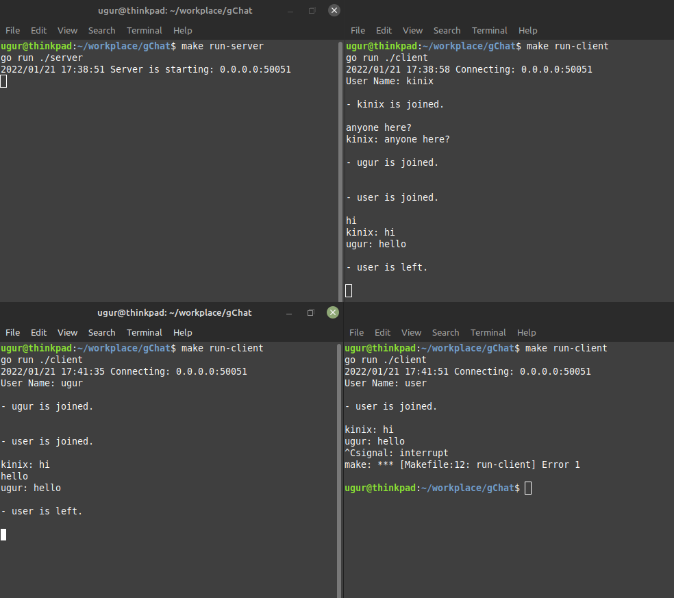

# gChat

Simple Go + gRPC chat application.

My main goal was creating a simple chat application by using gRPC bidirectional stream. Therefore, some features might need lots of polish, but it works.

## Usage

You can use `make run-server` and `make run-client` in order to run the application.

If you want to change the server addres, you can set the environment variable `GCHAT_SERVER`.

## Screenshot

